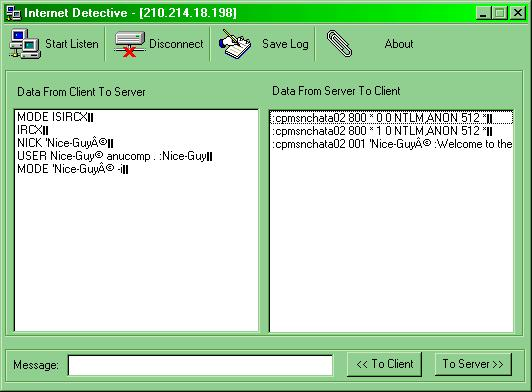



## Net Detective \- With eg of how to spy MSChat server/client

### Description

The purpose is to spy the data transmission

between two sockets. That is, our spy will

act between the server and client to get all data passing between them. 
 'Well, This is a simple program. If the name doesn't indicate anything, here is a short story:

I usually use Microsoft Chat for chatting.

(Usually my nick name is Nice-Guy, in case

u need to find me..) Just for understanding

the communication between the Microsoft chat

client and the server, I wrote this app..

But you can use it as a router,multi

chat enabler etc, if

you need to use it that way..
 
### More Info
 

             |
---                |---
**Submitted On**   |2000-09-20 23:26:48
**By**             |[Anoop Madhusudanan](https://github.com/Planet-Source-Code/PSCIndex/blob/master/ByAuthor/anoop-madhusudanan.md)
**Level**          |Intermediate
**User Rating**    |5.0 (65 globes from 13 users)
**Compatibility**  |VB 5\.0, VB 6\.0
**Category**       |[Internet/ HTML](https://github.com/Planet-Source-Code/PSCIndex/blob/master/ByCategory/internet-html__1-34.md)
**World**          |[Visual Basic](https://github.com/Planet-Source-Code/PSCIndex/blob/master/ByWorld/visual-basic.md)
**Archive File**   |[CODE\_UPLOAD100209202000\.zip](https://github.com/Planet-Source-Code/anoop-madhusudanan-net-detective-with-eg-of-how-to-spy-mschat-server-client__1-11572/archive/master.zip)

